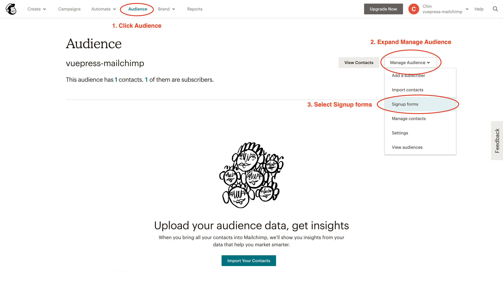
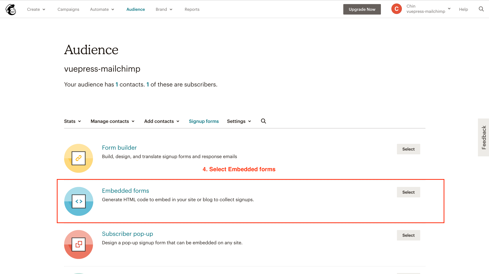
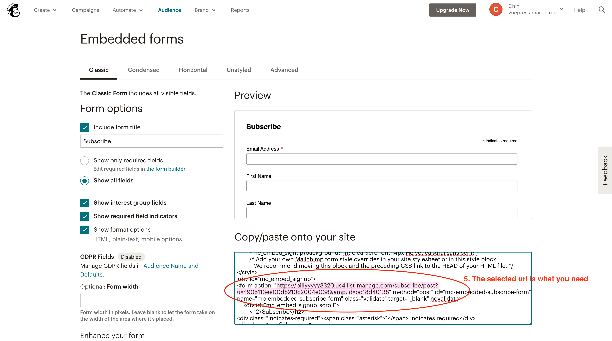

# VuePress-plugin-Mailchimp

Simplifies subscribing new email addresses to a Mailchimp email list.

## Install

First of all, you have to sign up for [Mailchimp](https://mailchimp.com/).

```bash
yarn add vuepress-plugin-mailchimp -D
# OR npm install vuepress-plugin-mailchimp -D
```

## Usage

Take a look at [Using a Plugin](https://vuepress.vuejs.org/plugin/using-a-plugin.html).

```javascript
// .vuepress/config.js
module.exports = {
  plugins: [
    "vuepress-plugin-mailchimp",
    {
      // You need to provide this plugin with your Mailchimp endpoint in order for it
      // to know where to save the email address. See more detail in Config section.
      endpoint: ""
    }
  ]
};
```

### `<SimpleNewsletter/>`

This plugin provides a out-of-box component. Since it has been registered automatically, you can simply use it in your `.md` file.

- Source code:[SimpleNewsletter.vue](https://github.com/newsbielt703/vuepress-plugin-mailchimp/blob/master/src/SimpleNewsletter.vue)
- Usage:

```md
// .md file

...
your content
...

<SimpleNewsletter/>
```

or

```vue
// .vue file

<template>
  <SimpleNewsletter />
</template>

<script>
import { SimpleNewsletter } from "vuepress-plugin-mailchimp/src/components/SimpleNewsletter";
export default {
  components: {
    SimpleNewsletter
  }
};
</script>
```

- [output](#demo)

## Config

### endpoint

- Type: `string`
- Required: true

How to get your endpoint:





### title

- Type: `string`
- Required: false
- Default: `'NewSletter'`

To be rendered as newsletter's title in `<SimpleNewsletter/>`

### content

- Type: `string`
- Required: false
- Default: `'Subscribe to get my lastest content. No spam.'`

To be rendered as newsletter's content in `<SimpleNewsletter/>`

### popupConfig

- Type: `object`
- Required: false
- Default: See below

#### enabled

- Type: `boolean`
- Default: true

Showing the popup after subscribing. You can stop showing the popup by setting to `false`.

#### popupComponent

- Type: `string`
- Default: `Popup`

A custom component to replace the default popup component.

**Also see**:

- [UI Customization](#ui-customization)

#### timeout

- Type: `number`
- Default: 3000

## UI Customization

### NewSletter

The out-of-box component provides a default slot which gives you the ability to fully control the appearance.

First, you need to create a global component (e.g. MyNewsletter) at .vuepress/components. There're some slot props to simplifies your customization:

- `title`: The title you've set in [config](#title)
- `content`The content you've set in [config](#content)
- `mail`: No matter how you customize, you still need an email input. Please make sure binding this prop to the field.

e.g.

```vue
<template>
  <SimpleNewsletter v-slot="{ title, content, mail }">
    <div class="my-title">{{ title }}</div>
    <div class="my-content">{{ content }}</div>
    <input
      class="my-input"
      type="email"
      name="email"
      aria-label="Email"
      placeholder="Email"
      v-model="mail"
      required
      autocapitalize="off"
      autocorrect="off"
      data-cy="email"
    />
    <button type="submit" class="my-button" data-cy="submit">
      STAY UP TO DATE
    </button>
  </SimpleNewsletter>
</template>

<script>
import SimpleNewsletter from "vuepress-plugin-mailchimp/src/components/SimpleNewsletter";
export default {
  components: { SimpleNewsletter }
};
</script>

<style>
/* your style */
</style>
```

:::warning
A submit button is required.
:::

### Popup

The popup component also provides a default slot and slot props:

- `enabled`: Whether the user have made subscription or not. It's probably the time for rendering.
- `message`: Default is `Thank you for subscribing!` or `Request failed!`.
- `isError`: You'll need it if you'd like to have different ui when the subscribing is failed.

e.g.

```vue
<template>
  <Popup v-slot="{ enabled, message, isError }">
    <div v-if="enabled" class="my-submit-popup" :class="{ error: isError }">
      <h1>UI Customization</h1>
      {{ message }}
    </div>
  </Popup>
</template>

<script>
import Popup from "vuepress-plugin-mailchimp/src/components/Popup";
export default {
  components: { Popup }
};
</script>

<style>
/* your style */
</style>
```

### More

This plugin use JSONP for cross domain request saving your from CORS issue. The method is exported from `mailchimpSubscribe.js` which accepts a required argument (email) and a optional fields. If you don't like the out-of-box component and the two approaches to customization can't meet your need, you might want to use this method to build your own component.

e.g.

```vue
<template>
  <div>
    <input type="email" v-model="mail" placeholder="email" />
    <input type="text" v-model="name" placeholder="name" />
    <button @click="onCilck">Click me!</button>
  </div>
</template>

<script>
import subscribeToMailchimp from "vuepress-plugin-mailchimp/src/mailchimpSubscribe";
export default {
  data() {
    return {
      mail: "",
      name: ""
    };
  },
  methods: {
    onCilck() {
      subscribeToMailchimp(this.mail, { LNAME: name }).then(res => {
        alert("Well done!");
      });
    }
  }
};
</script>
```

## Demo

<SimpleNewsletter/>
